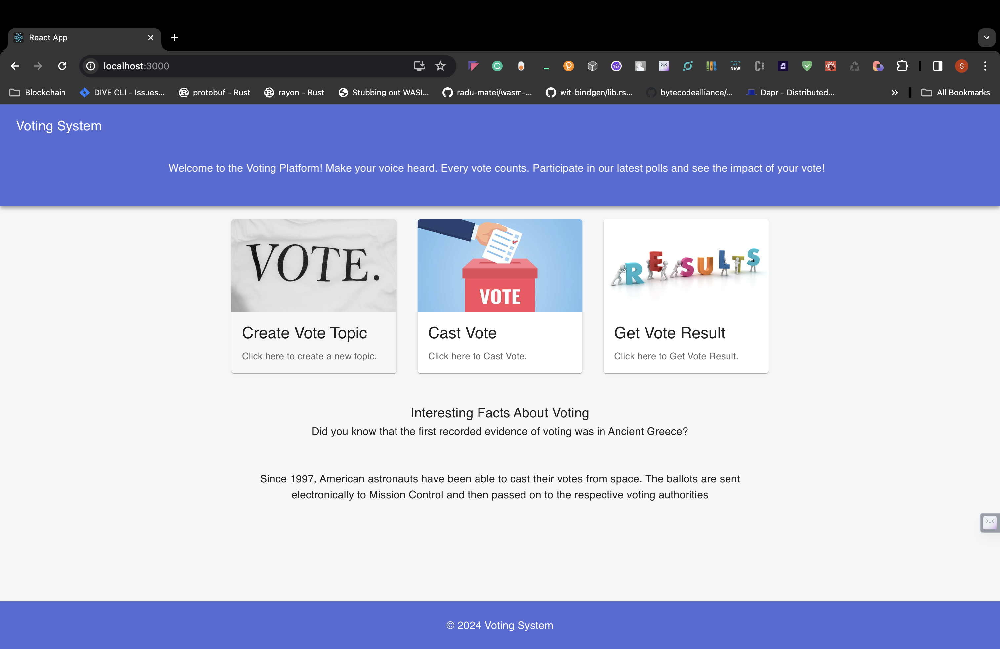
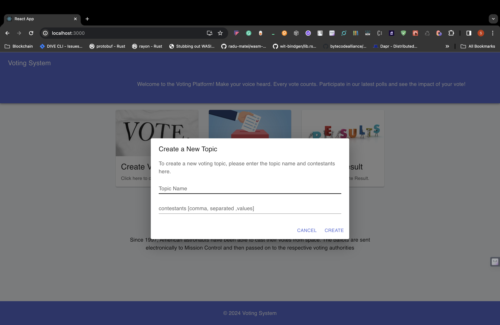
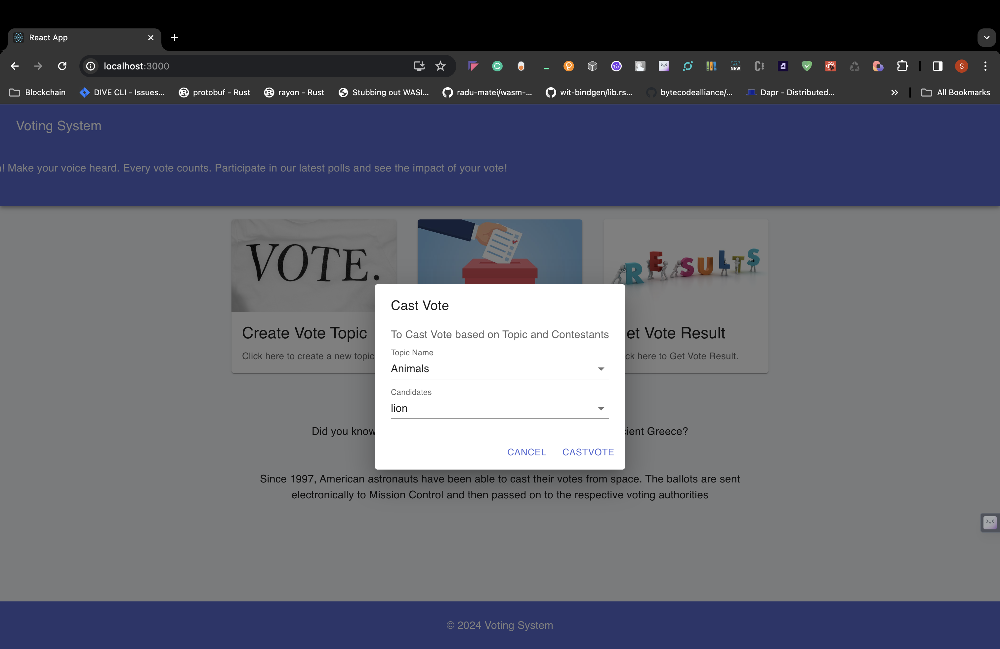
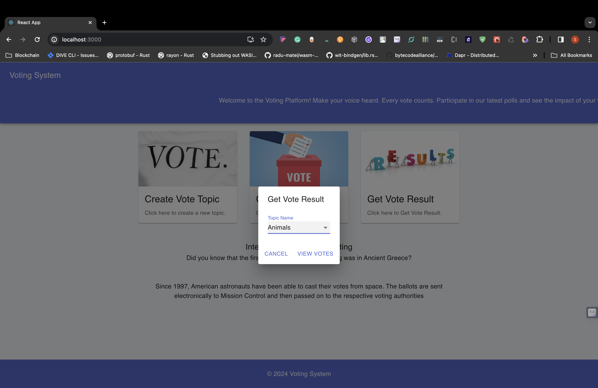
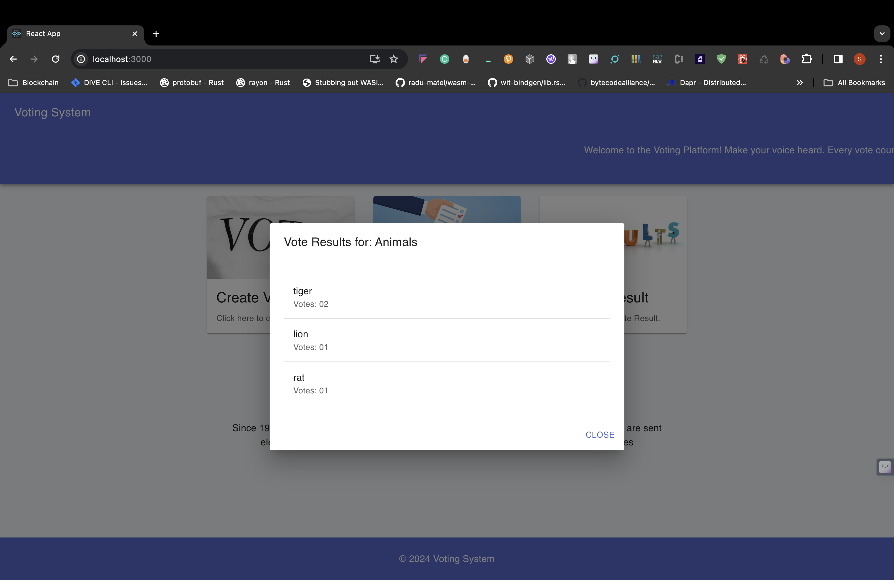

# Voting System - A Solana Dapp with Node.js and React frontend

# Overview

This project is a comprehensive voting system built on the Solana blockchain, utilizing Rust for smart contract development, Node.js for the backend, and React.js for the frontend. It allows users to create voting topics, cast votes, and view vote counts.

# Getting Started

To run this example you will need to install:

- [Rust](https://www.rust-lang.org/)
- [Anchor](https://www.anchor-lang.com/docs/installation)
- [Solana](https://docs.solana.com/cli/install-solana-cli-tools)
- [Nodejs](https://nodejs.org/en/download)

Once you've completed the installation run the following commands to configure your machine for local development:

```
solana-keygen new
solana config set --url localhost
solana config set -k ~/.config/solana/id.json
```

These two commands create Solana config files in `~/.config/solana/` which solana command line tools will read in to determine what cluster to connect to and what keypair to use.
Having done that run a local Solana validator by running:

```
solana-test-validator
```

# Building and Testing Solana Program

Check for the anchor version by running

```
anchor-cli 0.29.0
```

To build the Solana program we need to run

```
anchor build
```

Test the Solana program by running

```
npm install

anchor test
```

# Deploying and Interacting With Solana Program

Deploy your program by running

```
solana program deploy target/deploy/voting_dapp.so
```

Install node dependency

```
cd  app
npm install
```

Open a new terminal and start the backend service

```
node backend/server.js
```

In another terminal start the frontend service

```
npm start
```

Now we can open `http://localhost:3000` to interact with Solana program

Home Page


Create Vote Topic


Cast Vote


View Votes


Votes Result

